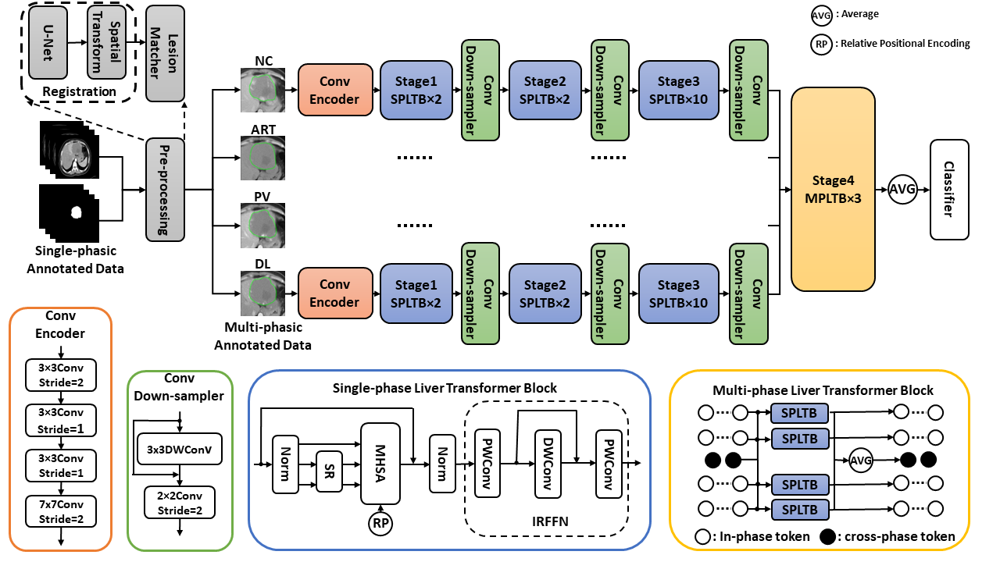

# TransLiver
Code for MICCAI2023 paper:  TransLiver: A Hybrid Transformer Model for Multi-phase Liver Lesion Classification.

TransLiver is a hybrid framework with ViT backbone for liver lesion classification, which achieves an overall accuracy of 90.9% on an in-house dataset of four CT phases and seven liver lesion classes. We design a pre-processing unit to reduce the annotation cost, where we obtain lesion area on multi-phase CTs from annotations marked on a single phase. To alleviate the limitations of pure transformers, we propose a multi-stage pyramid structure and add convolutional layers to the original transformer encoder, which helps improve the model performance. We use additional cross phase tokens at the last stage to complete a multi-phase fusion, which can focus on cross-phase communication and improve the fusion effectiveness as compared with conventional modes.

## Requirements

We use Python 3.9.12 in our project. The main packages are included in `requirements.txt`.

## Dataset

Please prepare your own single-phase annotated data with lesion position and class. The data and its position label should be placed in `/path/to/your/dataset/phase` and `/path/to/your/dataset/phase_label`, e.g., `/dataset/artery` and `/dataset/artery_label`. The class label should be placed in `/path/to/lesions`, which is the directory of pre-processed lesion data.

The data and position labels should be processed to `.nii.gz`, and the class labels should be processed to one json file with the lesion id as the key and the class id as the value.

We have given parts of data processing codes in `./register/reg_preprocess.py`, `./register/reg_postprocess.py`, and `./classification/preprocess.py`. You can also process your data with your own methods, but you should change the data reading mode.

## Getting Started

The data paths and hyperparameters should be changed according to your own project. Please see `./register/config.py` and `./classification/config.py`.

### Pre-processing

#### register

The voxelmorph code in pytorch is in reference of [VoxelMorph-torch](https://github.com/zuzhiang/VoxelMorph-torch).

- `./register/reg_preprocess.py`: preprocess for register
- `./register/reg_train.py`: register train
- `./register/reg_test.py`: register all data
- `./register/reg_postprocess.py`: lesion matcher

#### classification

`./classification/preprocess.py`: preprocess for classification

### Train

Get pretrain weights of [CMT-S](https://github.com/huawei-noah/Efficient-AI-Backbones/tree/master/cmt_pytorch) in `./pre`.

Please execute `./classification/run.sh`.

### Inference

Please run `./classification/test.py`.

## BibTeX

